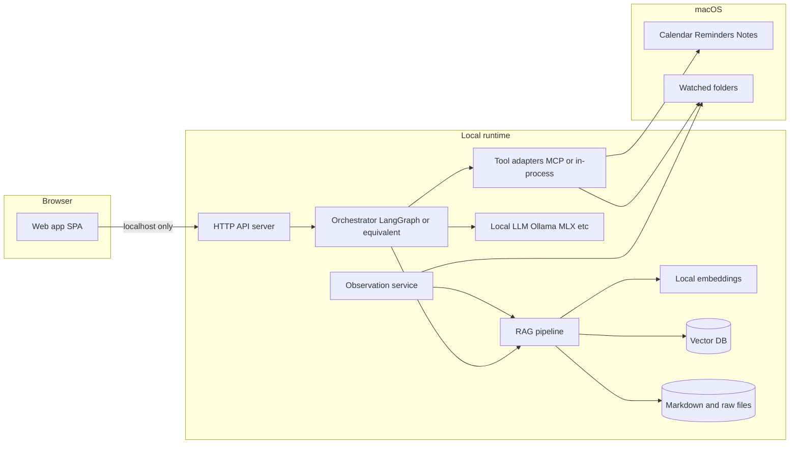

# Architecture

## 1. Goals

- **Local-first:** All durable state and inference stay on the Mac; no cloud dependency for core features ([`requirement.md`](../../requirement.md) FR-8, NFR-3).
- **Web-first UX:** The main interface is a **browser-based app** talking to a **local-only** HTTP API (see [`http-api.md`](http-api.md)).
- **Observable OS data:** File watching and Apple integrations run where macOS APIs are available (typically a native helper or privileged subprocess), feeding the same memory pipeline as manual entries. **Phasing:** prefer **user-chosen folders** and **EventKit** (Calendar / Reminders) before fragile or unsupported sources; see [`requirement.md`](../../requirement.md) §2.1.1 and [`milestones.md`](milestones.md).
- **On-device LLM:** Chat and tool-using turns call a **local** inference runtime on the Mac (no cloud LLM in the default configuration). Prefer **Apple Silicon–friendly** stacks—e.g. **Ollama** (separate daemon + HTTP), **MLX** via **[mlx-lm](https://github.com/ml-explore/mlx-lm)** (Python: load models and generate in-process or behind a thin local server), or **llama.cpp**-compatible servers—so latency and memory stay predictable on M-series hardware.

## 2. Logical components

## 3. Process model (recommended)

| Process | Role |
| :--- | :--- |
| **Core service** | Hosts HTTP API, RAG, embeddings, vector DB access, chat orchestration. Single user, single machine. |
| **Web static assets** | Served by the same core service (embedded) or a dev Vite server in development only. Production build: same-origin API and UI. |
| **Observation worker** | May run in-process (simplest) or as a child process with IPC if isolation is needed for stability or CPU caps. |
| **Native bridge (optional)** | Small Swift helper if EventKit, AppleScript, or system UI automation requires it; exposes narrow IPC to the core service. |

Keeping the **API and RAG in one service** avoids distributed transactions and simplifies the zero-cloud guarantee.

## 4. Data flow (query path)

1. User submits a prompt in the web app → `POST` chat or WebSocket message to local API.
2. Orchestrator may rewrite or decompose the query; retriever pulls top-k chunks from the vector store (and optional keyword/hybrid ranker).
3. Context + tool results are passed to the local LLM; response streamed to the client (SSE or WebSocket).
4. Assistant turns may invoke tools (file search, **memory save**, **calendar read/create**, etc.) with explicit policy checks; see [`agent-actions.md`](agent-actions.md).

## 5. Data flow (ingestion path)

1. File system events or scheduled scans enqueue **raw documents** with metadata (path, mtime, source).
2. Extraction supports `.md`, `.txt`, `.pdf`, `.docx` with per-format size guardrails and timeout/error handling.
3. File index metadata DB decides skip/reindex for unchanged files; changed files continue to chunking (see [`data-model.md`](data-model.md)).
4. Embeddings computed locally → upsert into vector DB; **human-readable** Markdown mirrors updated per policy (not necessarily 1:1 with every chunk).

## 6. Web UI constraints

- **Binding:** Default `127.0.0.1` on a configurable port; document that binding to `0.0.0.0` is opt-in and weakens the local trust boundary.
- **Transport:** `http://localhost` is acceptable for MVP; optional TLS for local dev parity only if needed.
- **Security model:** Treat the API as **authenticated local use** (e.g. random token on first launch stored in app support, required header or cookie). Prevents other local processes from silently driving the agent without user intent.

## 7. Technology choices (open items)

| Area | Options | Decision record |
| :--- | :--- | :--- |
| **LLM runtime (on-device)** | **Ollama** (HTTP API, simple pulls), **mlx-lm** (MLX models; often embedded in the core service for tight integration), **llama.cpp** / **LM Studio** server, etc. | Must run **locally**; abstract behind a small `LocalLlmClient` so the orchestrator does not depend on one vendor. Default install path should be documented (e.g. user installs Ollama.app, or **pip**-install **mlx-lm** and ship MLX-converted weights). |
| Vector DB | LanceDB, Chroma | Choose one in implementation; abstract with a thin repository interface. |
| Orchestration | LangGraph, CrewAI, custom | Pick based on team familiarity and debuggability. |
| Native UI | Swift menu bar (optional) | Defer after web MVP unless OS integration requires it sooner. |

## 8. Non-functional mapping

- **NFR-1 (2s to first token):** Budget includes retrieval + prompt assembly + model cold start; define a “warm” vs “cold” scenario in tests.
- **NFR-2 (5% CPU idle):** Observation uses debouncing, batching, and pauses when on battery if configured later.
