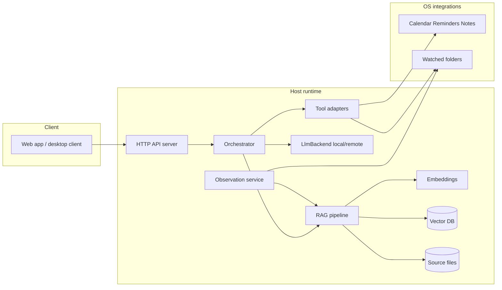
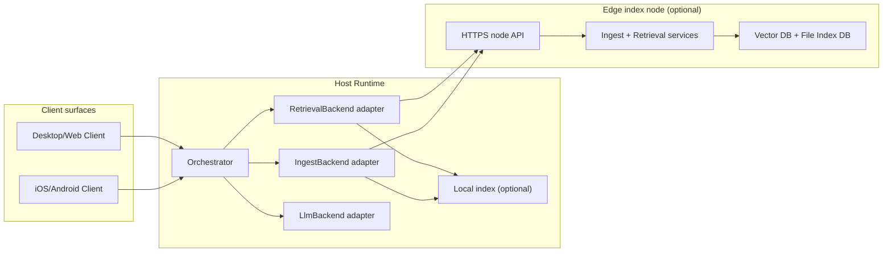

# Architecture

## 1. Goals

- **Local-first:** Durable state remains user-controlled on local or user-owned nodes; cloud dependency is optional, not required for core features ([`requirement.md`](../../requirement.md) FR-8, NFR-3).
- **HTTP-first app surface:** User-facing clients communicate through HTTP(S) API contracts (see [`client-api.md`](client-api.md)).
- **Portable deployment modes:** Same orchestration logic supports standalone and distributed topologies via backend adapters; see [`distributed-future-plan.md`](distributed-future-plan.md).
- **Platform-capability ingestion:** Source access depends on platform adapters/permissions (desktop/mobile), feeding the same memory pipeline.
- **LLM placement flexibility:** LLM can run local to host or remote service while preserving the same orchestrator behavior.

### Canonical role names

- **Client**: user-facing app surface (web/desktop/mobile).
- **Host Backend**: primary API + orchestrator runtime that serves Client API.
- **Edge Node**: optional ingest/retrieval runtime used by Host Backend through Node API.

## 2. Logical components (standalone baseline)

## 3. Deployment topology (distributed-capable)

## 4. Process model (recommended)

| Process | Role |
| :--- | :--- |
| **Core service (host)** | Hosts user-facing HTTP API + orchestrator and backend adapters. |
| **Web static assets** | Served by the same core service (embedded) or a dev Vite server in development only. Production build: same-origin API and UI. |
| **Observation worker** | May run on host or edge node depending on deployment mode. |
| **Native bridge (optional)** | Small Swift helper if EventKit, AppleScript, or system UI automation requires it; exposes narrow IPC to the core service. |
| **Edge index node (optional)** | Dedicated ingest/retrieval node exposed via HTTPS control API. |

In standalone mode, all adapters resolve locally. In distributed modes, retrieval/ingest adapters may target remote edge services while preserving one orchestration path.

## 5. Data flow (query path)

1. User submits a prompt from desktop/mobile client to host API.
2. Orchestrator calls `RetrievalBackend` (local, remote, or hybrid fan-out).
3. Context + tool results are passed to `LlmBackend`; response streams back to client.
4. Assistant turns may invoke tools (file search, **memory save**, **calendar read/create**, etc.) with explicit policy checks; see [`agent-actions.md`](agent-actions.md).

**Calendar sources:** If the user does **not** select **Include Google Calendar**, only the **local** platform calendar is used (e.g. EventKit on macOS); Google APIs are not called (tokens may remain stored per policy). If they **do** select it and OAuth succeeds, **both** local and **Google Calendar** are used. **Disconnect Google** removes credentials. Details: [`google-calendar-integration.md`](google-calendar-integration.md).

## 6. Data flow (ingestion path)

1. File system events or scheduled scans enqueue **raw documents** with metadata (path, mtime, source).
2. Extraction supports `.md`, `.txt`, `.pdf`, `.docx` with per-format size guardrails and timeout/error handling.
3. File index metadata DB decides skip/reindex for unchanged files; changed files continue to chunking (see [`data-model.md`](data-model.md)).
4. Embeddings computed locally → upsert into vector DB; **human-readable** Markdown mirrors updated per policy (not necessarily 1:1 with every chunk).

## 7. Degraded/fallback behavior

- If remote retrieval is unavailable, host falls back to local retrieval when available and marks response metadata as degraded.
- If both retrieval paths fail, API returns `UNAVAILABLE` with retryable guidance.
- Ingest/control failures on remote edge return explicit action errors; no silent success.

## 8. Web/API constraints

- **Binding:** Host API defaults to loopback for local mode; distributed mode explicitly configures reachable interfaces.
- **Transport:** HTTP for local development, HTTPS required for networked control plane.
- **Security model:** Token auth baseline; mTLS-ready design for stronger network trust boundaries.
- **Admin/Debug mode:** privileged control endpoints are available only in explicit debug/admin mode with stronger confirmation and audit requirements.

## 9. Endpoint surfaces (where they live)

### 9.1 Client API (client -> host)

- Base: `http://127.0.0.1:<port>/api/v1/` (local mode), `https://<host>/api/v1/` (distributed)
- Example routes:
  - `POST /api/v1/chat`
  - `POST /api/v1/chat/stream`
  - `POST /api/v1/memory/entries`
  - `GET /api/v1/memory/search`
  - `GET /api/v1/config`

### 9.2 Node API (host -> edge, distributed modes)

- Base: `https://<edge-node>/` (or implementation-specific prefix)
- Example routes:
  - `GET /health`
  - `GET /index/status`
  - `POST /retrieve`
  - `POST /ingest`
  - `POST /control/reindex`

### 9.3 Documentation ownership

- Client API route contracts: [`client-api.md`](client-api.md)
- Node API route contracts: [`node-api.md`](node-api.md)
- Distributed mode behavior and decisions: [`distributed-future-plan.md`](distributed-future-plan.md)

## 10. Technology choices (open items)

| Area | Options | Decision record |
| :--- | :--- | :--- |
| **LLM runtime (on-device)** | **Ollama** (HTTP API, simple pulls), **mlx-lm** (MLX models; often embedded in the core service for tight integration), **llama.cpp** / **LM Studio** server, etc. | Must run **locally**; abstract behind a small `LocalLlmClient` so the orchestrator does not depend on one vendor. Default install path should be documented (e.g. user installs Ollama.app, or **pip**-install **mlx-lm** and ship MLX-converted weights). |
| Vector DB | LanceDB, Chroma | Choose one in implementation; abstract with a thin repository interface. |
| Orchestration | LangGraph, CrewAI, custom | Pick based on team familiarity and debuggability. |
| Native UI | Swift menu bar (optional) | Defer after web MVP unless OS integration requires it sooner. |

## 11. Non-functional mapping

- **NFR-1 (2s to first token):** Budget includes retrieval + prompt assembly + model cold start; define a “warm” vs “cold” scenario in tests.
- **NFR-2 (5% CPU idle):** Observation uses debouncing, batching, and pauses when on battery if configured later.
