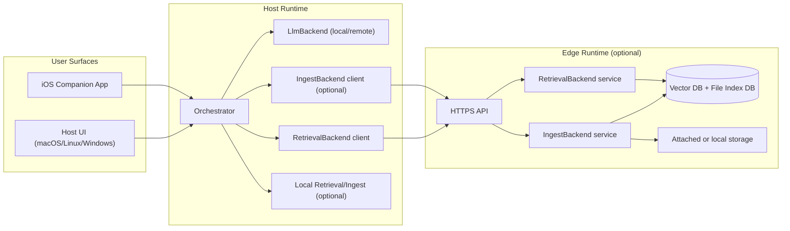

# Distributed future plan

This plan captures the architecture evolution for distributed deployments across:

- host devices (macOS, Linux, Windows)
- optional edge index node (low-power or dedicated machine; Raspberry Pi is one example)
- optional mobile client (iOS companion with on-device lightweight reasoning)

## Terminology

- **Ingest**: the write/index pipeline that converts source content into searchable chunks (extract -> normalize -> chunk -> embed -> upsert metadata/vectors).
- **Reindex / Re-ingest**: running ingest again because source content, parser behavior, or indexing policy changed.
- **Skip ingest**: short-circuit when source is unchanged (using file index metadata such as size/mtime/parser version).
- **Retrieval**: read path that finds and ranks relevant indexed chunks for a query.
- **Chunk**: a bounded text segment produced from a source document for embedding and retrieval.
- **Embedding**: numeric vector representation of a chunk or query used for semantic similarity search.
- **File index DB**: metadata store used to decide whether a source needs reindexing.
- **Vector DB**: store of embeddings + chunk metadata used for semantic retrieval.
- **IngestBackend**: backend contract responsible for ingest/reindex/status operations.
- **RetrievalBackend**: backend contract responsible for search/filter/ranking operations.
- **LlmBackend**: backend contract responsible for language generation (chat/stream) from messages + retrieved context.
- **Control plane**: service-to-service commands and status APIs (HTTPS/gRPC).
- **Data plane**: underlying content storage and transfer path for source files/chunks.
- **Edge index node**: optional always-on node dedicated to ingestion and retrieval services.
- **Host**: user-facing runtime (desktop/laptop) that orchestrates prompts/tools and may run the LLM.
- **Hybrid mode**: retrieval fan-out to both local and remote backends, then merge/dedupe/rerank.
- **Degraded mode**: reduced-function behavior when one backend is unavailable (for example, local-only retrieval fallback).

## 1) Architecture-first planning rule

Before implementation phases, freeze:

- backend interface contracts (`RetrievalBackend`, `IngestBackend`, `LlmBackend`)
- deployment modes and control/data plane boundaries
- cross-node API and security model
- degraded-mode behavior

Detailed implementation steps start only after these are agreed.

## 2) Product direction

Support multiple deployment modes under one codebase and one logical API contract.

### Mode A — Standalone (current baseline)

- One machine runs ingestion, retrieval, and LLM.
- Best for simple local-first personal setup.

### Mode B — Host + edge index node

- Host (Mac/Linux/Windows): user-facing chat + LLM inference.
- Edge index node: always-on ingestion/index/retrieval service.
- Transport: HTTPS control plane.

### Mode C — Hybrid retrieval (local + edge)

- Local host index and edge index are both queried.
- Results are merged/reranked with source-aware citations.
- Degrades gracefully when one backend is unavailable.

### Mode D — iOS companion

- iOS app acts as UI/controller with optional on-device Foundation-model reasoning.
- Heavy indexing/retrieval remains on host/edge nodes.

## 3) High-level architecture (logical)

## 4) Backend contracts (normative definitions)

### 4.1 `RetrievalBackend`

Purpose: ranked context retrieval for prompts, independent of storage location.

Responsibilities:

- semantic search over indexed chunks
- metadata filtering (`source_kind`, `path_prefix`, date bounds)
- normalized scoring and source/citation traceability
- health/capability reporting

Contract shape:

- `search(query, limit, filters) -> list[SearchHit]`
- `health() -> BackendHealth`
- `capabilities() -> RetrievalCapabilities`

### 4.2 `IngestBackend`

Purpose: ingest/update source data into searchable index.

Responsibilities:

- file/memory ingest flows
- extract/chunk/embed/upsert pipeline
- incremental skip/reindex via file index metadata
- queue/status/reindex control

Contract shape:

- `ingest_file(path) -> IngestResult`
- `ingest_memory(text, tags, source) -> IngestResult`
- `reindex(scope) -> JobId`
- `status(job_id?) -> IngestStatus`
- `health() -> BackendHealth`

### 4.3 `LlmBackend`

Purpose: completion/streaming generation from messages + retrieved context.

Responsibilities:

- chat generation (sync/stream)
- model health and model metadata reporting
- bounded prompt/context handling

Contract shape:

- `chat(messages, context_blocks, options) -> ChatOutput`
- `chat_stream(messages, context_blocks, options) -> TokenEvent stream`
- `health() -> BackendHealth`
- `model_info() -> ModelInfo`

### 4.4 Contract boundaries

- `IngestBackend` is write/index path.
- `RetrievalBackend` is read/rank path.
- `LlmBackend` is generation path.
- Orchestrator composes all three and owns policy/routing.

## 5) Control plane and data plane

### Data plane

- File storage access via local/attached storage on whichever node owns ingestion.
- Edge node recommended as always-on index owner for large/continuous ingestion.

### Control plane

- HTTPS API between components (host <-> edge, iOS <-> host/edge).
- Keep a stable JSON API contract first; optional gRPC later for internal optimization.

## 6) Security baseline

For networked deployments (Wi-Fi or LAN):

- TLS required for control APIs (HTTPS).
- Token auth required; design for mTLS-ready upgrade path.
- Bind services to intended interfaces only; avoid broad `0.0.0.0` exposure by default.
- Firewall allowlist host/client IPs where feasible.
- Separate storage credentials from API credentials.
- Audit security-sensitive control actions (reindex, delete, config changes).

## 7) API contract direction (host/edge)

Minimum cross-node endpoints (normative target):

- `GET /health` — node health and capabilities
- `GET /index/status` — queue depth, last indexed time, error counters
- `POST /retrieve` — query + metadata filters; returns ranked chunks + citations
- `POST /ingest` — optional explicit ingest trigger
- `POST /control/reindex` — controlled reindex operations

## 8) Config profiles (single codebase)

- `deployment_mode`: `standalone` | `host_edge` | `hybrid` | `ios_companion`
- `retrieval_backends`: `["local"]`, `["remote_edge"]`, or both
- `llm_backend`: `local` | `remote_host`
- `remote_retrieval_base_url`
- `security`: token, TLS settings, optional mTLS settings
- low-resource toggles for edge profile

## 9) Acceptance criteria

- Same user prompts work across deployment modes with documented behavior deltas.
- Retrieval correctness and citation traceability preserved in hybrid mode.
- If remote edge is unavailable, host remains usable in degraded local mode.
- Security checks pass for networked mode (TLS/auth/firewall baseline).
- Platform docs include setup for macOS/Linux/Windows hosts and iOS companion mode.
