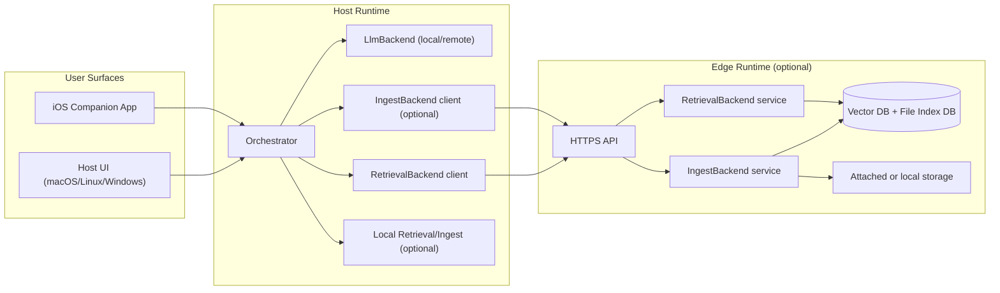
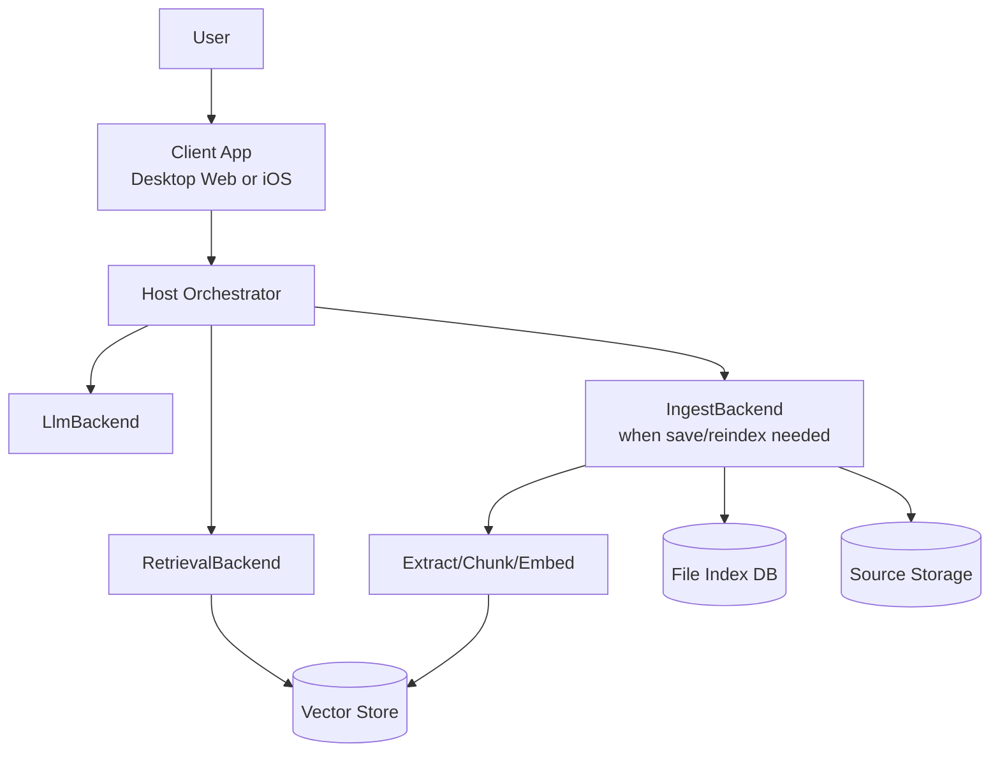
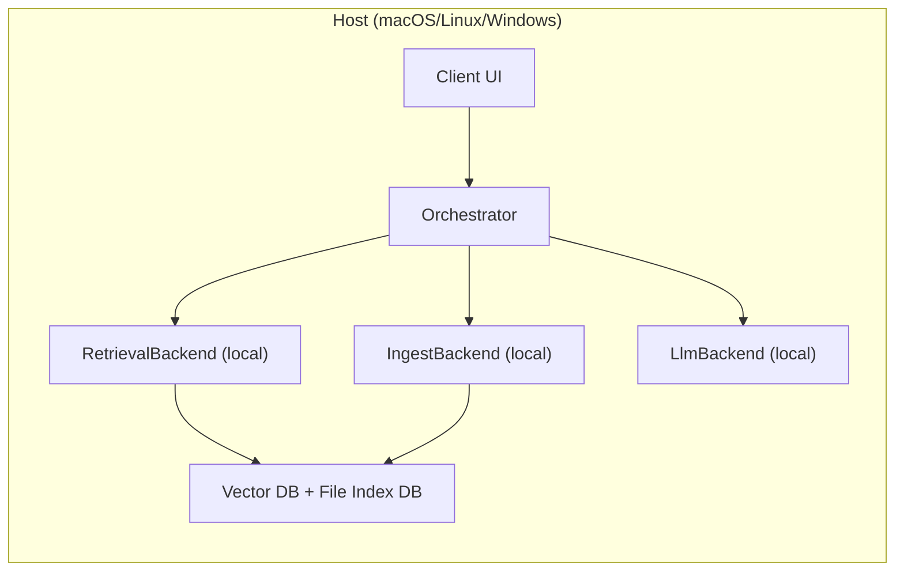
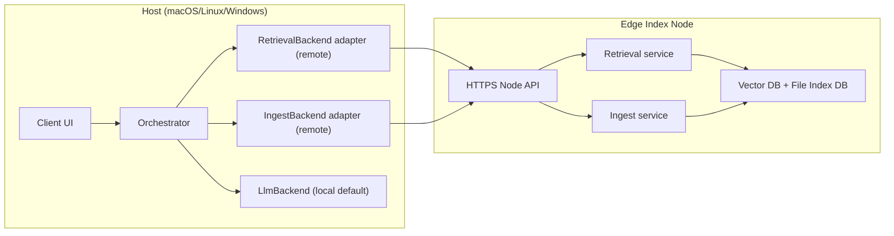
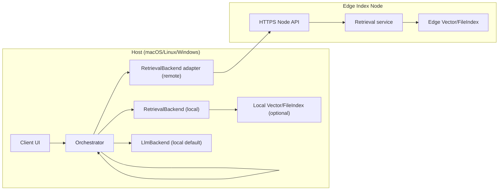
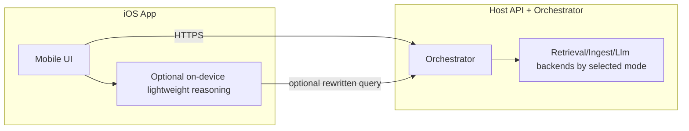
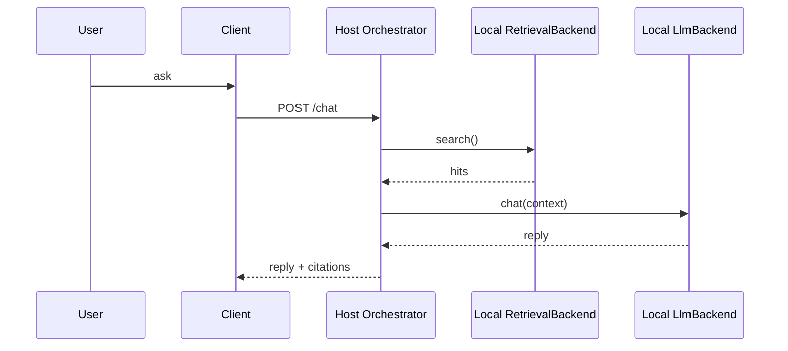
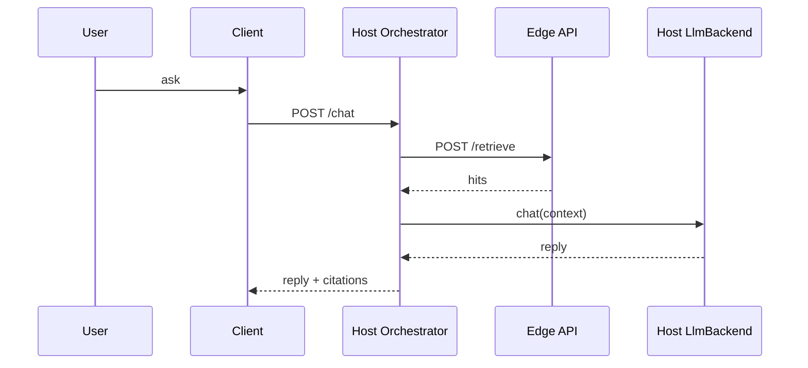
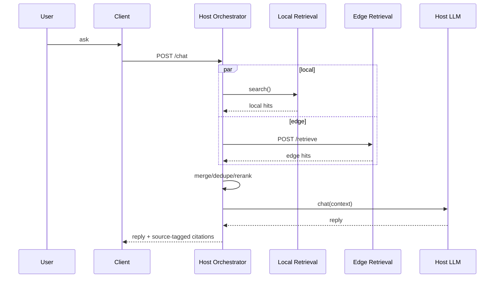
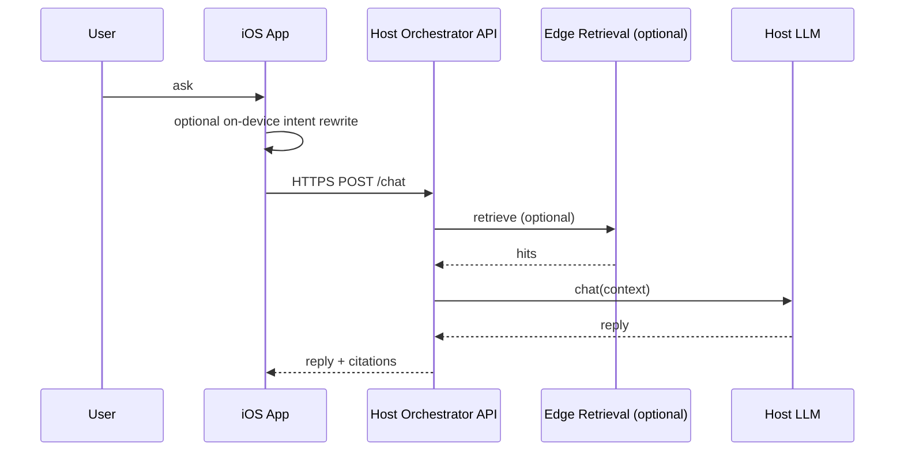

# Distributed future plan

This plan captures the architecture evolution for distributed deployments across:

- host devices (macOS, Linux, Windows)
- optional edge index node (low-power or dedicated machine; Raspberry Pi is one example)
- optional mobile client (iOS companion with on-device lightweight reasoning)

## Terminology

- **Ingest**: the write/index pipeline that converts source content into searchable chunks (extract -> normalize -> chunk -> embed -> upsert metadata/vectors).
- **Reindex / Re-ingest**: running ingest again because source content, parser behavior, or indexing policy changed.
- **Skip ingest**: short-circuit when source is unchanged (using file index metadata such as size/mtime/parser version).
- **Retrieval**: read path that finds and ranks relevant indexed chunks for a query.
- **Chunk**: a bounded text segment produced from a source document for embedding and retrieval.
- **Embedding**: numeric vector representation of a chunk or query used for semantic similarity search.
- **File index DB**: metadata store used to decide whether a source needs reindexing.
- **Vector DB**: store of embeddings + chunk metadata used for semantic retrieval.
- **IngestBackend**: backend contract responsible for ingest/reindex/status operations.
- **RetrievalBackend**: backend contract responsible for search/filter/ranking operations.
- **LlmBackend**: backend contract responsible for language generation (chat/stream) from messages + retrieved context.
- **Control plane**: service-to-service commands and status APIs (HTTPS/gRPC).
- **Data plane**: underlying content storage and transfer path for source files/chunks.
- **Edge index node**: optional always-on node dedicated to ingestion and retrieval services.
- **Client**: user-facing application surface (web app, desktop app, iOS/Android app) that sends requests to Host Backend.
- **Host Backend**: primary server runtime that exposes Client API, runs orchestrator, and coordinates backend adapters.
- **Edge Node**: optional secondary server runtime dedicated to ingest/retrieval services and index storage.
- **Hybrid mode**: retrieval fan-out to both local and remote backends, then merge/dedupe/rerank.
- **Degraded mode**: reduced-function behavior when one backend is unavailable (for example, local-only retrieval fallback).

## 1) Architecture-first planning rule

Before implementation phases, freeze:

- backend interface contracts (`RetrievalBackend`, `IngestBackend`, `LlmBackend`)
- deployment modes and control/data plane boundaries
- cross-node API and security model
- degraded-mode behavior

Detailed implementation steps start only after these are agreed.

## 2) Product direction

Support multiple deployment modes under one codebase and one logical API contract.

### Mode A — Standalone (current baseline)

- One machine runs ingestion, retrieval, and LLM.
- Best for simple local-first personal setup.

### Mode B — Host + edge index node

- Host (Mac/Linux/Windows): user-facing chat + LLM inference.
- Edge index node: always-on ingestion/index/retrieval service.
- Transport: HTTPS control plane.

### Mode C — Hybrid retrieval (local + edge)

- Local host index and edge index are both queried.
- Results are merged/reranked with source-aware citations.
- Degrades gracefully when one backend is unavailable.

### Mode D — iOS companion

- iOS app acts as UI/controller with optional on-device Foundation-model reasoning.
- Heavy indexing/retrieval remains on host/edge nodes.

## 3) High-level architecture (logical)

This document is the detailed distributed extension of [`architecture.md`](architecture.md).
`architecture.md` remains the concise architectural baseline; this file defines distributed contracts and mode-specific API/message behavior.



## 3.1 Functional block flow (normative)



Request-time flow:

1. Client sends user request to Host Orchestrator.
2. Orchestrator calls `RetrievalBackend.search(...)` for context.
3. Orchestrator calls `LlmBackend.chat(...)` (or stream) with context.
4. Orchestrator returns reply + citations to client.

Ingest-time flow:

1. `IngestBackend` receives file/memory/reindex trigger.
2. It checks file index metadata (skip vs reindex).
3. If reindex required, it extracts/chunks/embeds and upserts vector store.
4. It updates file index metadata and returns ingest status/result.

## 3.2 Mode-to-block placement matrix

| Block | `standalone` | `host_edge` | `hybrid` | `ios_companion` |
| :--- | :--- | :--- | :--- | :--- |
| Client UI | Host | Host and/or mobile | Host and/or mobile | iOS app |
| Orchestrator | Host | Host | Host | Host (or compatible server node) |
| `RetrievalBackend` | Host local adapter | Host remote adapter -> edge | Host local+remote adapters | Host/edge (iOS is client) |
| `IngestBackend` | Host local adapter | Usually edge service (via host remote adapter) | Host local and/or edge | Host/edge (iOS is client) |
| `LlmBackend` | Host local | Host local (default) | Host local (default) | Host local/remote; iOS lightweight optional |
| Vector DB + File Index DB | Host | Edge | Host and/or edge | Host and/or edge |
| Watcher / source observation | Host | Edge | Host and/or edge | N/A as required background service on iOS |

### Placement explanation by mode

#### `standalone`

- **Client** runs on the same machine as **Host Backend**.
- **Host Backend** owns orchestrator + local backend adapters + local index stores.
- **Edge Node** is not used.

#### `host_edge`

- **Client** calls **Host Backend**.
- **Host Backend** orchestrates requests and usually runs `LlmBackend` locally.
- **Edge Node** owns ingest/retrieval/index services; Host Backend accesses them via Node API.

#### `hybrid`

- **Client** calls **Host Backend**.
- **Host Backend** queries both local and edge retrieval paths.
- **Edge Node** provides additional ingest/retrieval/index capacity.
- Host Backend merges/dedupes/reranks local+edge results before generation.

#### `ios_companion`

- **Client** is iOS app (client-first; optional lightweight on-device reasoning).
- **Host Backend** is the primary API/orchestration endpoint for iOS.
- **Edge Node** is optional and used indirectly through Host Backend according to selected deployment mode.

## 3.3 Per-mode platform diagrams

### Mode A — `standalone`



### Mode B — `host_edge`



### Mode C — `hybrid`



### Mode D — `ios_companion`



## 3.4 Recommended defaults by mode

| Mode | Default `LlmBackend` placement | Default ingest owner | Default retrieval policy | Default degraded behavior | Security baseline |
| :--- | :--- | :--- | :--- | :--- | :--- |
| `standalone` | Host local | Host local | Local only | Return local result (no remote dependency) | Loopback + bearer token |
| `host_edge` | Host local | Edge node | Remote edge retrieval | If edge unavailable, fallback to local if present; else `UNAVAILABLE` | TLS + bearer token |
| `hybrid` | Host local | Host and/or edge (configurable) | Balanced merge of local + edge | Continue with whichever backend is available; mark `degraded=true` | TLS + bearer token (mTLS-ready) |
| `ios_companion` | Host local/remote service | Host/edge service | Host-selected mode (`standalone`/`host_edge`/`hybrid`) | iOS shows limited-mode notice when backend unavailable | TLS + bearer token; mobile secure storage for token |

Notes:

- `host_edge` can run without local host index, but local fallback is recommended where practical.
- `hybrid` default merge policy is **balanced** unless product requirements explicitly prefer `local_first` or `remote_first`.
- iOS companion remains client-first; optional on-device lightweight reasoning does not replace host/edge backend contracts.

## 4) Backend contracts (normative definitions)

### 4.1 `RetrievalBackend`

Purpose: ranked context retrieval for prompts, independent of storage location.

Responsibilities:

- semantic search over indexed chunks
- metadata filtering (`source_kind`, `path_prefix`, date bounds)
- normalized scoring and source/citation traceability
- health/capability reporting

Contract shape:

- `search(query, limit, filters) -> list[SearchHit]`
- `health() -> BackendHealth`
- `capabilities() -> RetrievalCapabilities`

### 4.2 `IngestBackend`

Purpose: ingest/update source data into searchable index.

Responsibilities:

- file/memory ingest flows
- extract/chunk/embed/upsert pipeline
- incremental skip/reindex via file index metadata
- queue/status/reindex control

Contract shape:

- `ingest_file(path) -> IngestResult`
- `ingest_memory(text, tags, source) -> IngestResult`
- `reindex(scope) -> JobId`
- `status(job_id?) -> IngestStatus`
- `health() -> BackendHealth`

### 4.3 `LlmBackend`

Purpose: completion/streaming generation from messages + retrieved context.

Responsibilities:

- chat generation (sync/stream)
- model health and model metadata reporting
- bounded prompt/context handling

Contract shape:

- `chat(messages, context_blocks, options) -> ChatOutput`
- `chat_stream(messages, context_blocks, options) -> TokenEvent stream`
- `health() -> BackendHealth`
- `model_info() -> ModelInfo`

### 4.4 Contract boundaries

- `IngestBackend` is write/index path.
- `RetrievalBackend` is read/rank path.
- `LlmBackend` is generation path.
- Orchestrator composes all three and owns policy/routing.

## 5) Control plane and data plane

### Data plane

- File storage access via local/attached storage on whichever node owns ingestion.
- Edge node recommended as always-on index owner for large/continuous ingestion.

### Control plane

- HTTPS API between components (host <-> edge, iOS <-> host/edge).
- Keep a stable JSON API contract first; optional gRPC later for internal optimization.

### Decision record — transport

- **Decision D2 (approved):** Node API transport is **HTTPS REST first**.
- **Rationale:** fastest cross-platform implementation, easiest debugging/ops, aligns with existing host API stack.
- **Future option:** introduce gRPC later for internal service optimization without changing Client API contracts.

## 6) Security baseline

For networked deployments (Wi-Fi or LAN):

- TLS required for control APIs (HTTPS).
- Token auth required; design for mTLS-ready upgrade path.
- Bind services to intended interfaces only; avoid broad `0.0.0.0` exposure by default.
- Firewall allowlist host/client IPs where feasible.
- Separate storage credentials from API credentials.
- Audit security-sensitive control actions (reindex, delete, config changes).

### Decision record — security baseline

- **Decision D3 (approved):** distributed mode v1 uses **TLS + bearer token**.
- **mTLS status:** not required for v1, but architecture and configuration remain mTLS-ready.

## 7) API contract direction (host/edge)

Minimum cross-node endpoints (normative target):

- `GET /health` — node health and capabilities
- `GET /index/status` — queue depth, last indexed time, error counters
- `POST /retrieve` — query + metadata filters; returns ranked chunks + citations
- `POST /ingest` — optional explicit ingest trigger
- `POST /control/reindex` — controlled reindex operations

## 7.2 Canonical message schemas (normative draft)

Canonical endpoint-level parameter/response definitions are maintained in [`node-api.md`](node-api.md).
This section remains as architecture-level context and examples.

Shared envelope conventions:

- Timestamps use ISO-8601 with timezone.
- IDs are opaque strings unless explicitly typed otherwise.
- Errors use the same shape across all node APIs.

### Error envelope

```json
{
  "error": {
    "code": "VALIDATION",
    "message": "indexed_after must be ISO-8601",
    "retryable": false,
    "details": {}
  }
}
```

Suggested error codes:

- `VALIDATION`
- `UNAUTHORIZED`
- `FORBIDDEN`
- `UNAVAILABLE`
- `TIMEOUT`
- `INDEX_BUSY`
- `INTERNAL`

### `POST /retrieve`

Request:

```json
{
  "query": "find bank statement in the last month",
  "limit": 8,
  "filters": {
    "source_kind": "file_pdf",
    "path_prefix": "file:///data/docs/",
    "indexed_after": "2026-03-01T00:00:00Z",
    "indexed_before": "2026-03-31T23:59:59Z"
  },
  "trace": {
    "request_id": "req_123",
    "caller": "host_orchestrator"
  }
}
```

Response:

```json
{
  "results": [
    {
      "chunk_id": "doc123:4",
      "document_id": "doc123",
      "snippet": "Statement amount ...",
      "score": 0.82,
      "source": "file:///data/docs/bank.pdf",
      "source_kind": "file_pdf",
      "indexed_at": "2026-04-22T10:10:00Z",
      "backend_id": "remote_edge"
    }
  ],
  "meta": {
    "query_ms": 42,
    "backend_id": "remote_edge",
    "total_candidates": 56
  }
}
```

### `POST /ingest`

Request (file):

```json
{
  "kind": "file",
  "path": "/data/docs/report.docx",
  "options": {
    "force_reindex": false
  }
}
```

Request (memory text):

```json
{
  "kind": "memory",
  "text": "Remember this project note",
  "tags": ["project"],
  "source": "remote_host"
}
```

Response:

```json
{
  "job_id": "job_456",
  "status": "accepted"
}
```

### `GET /index/status`

Response:

```json
{
  "queue_depth": 3,
  "active_jobs": 1,
  "last_indexed_at": "2026-04-22T10:25:00Z",
  "last_error": null,
  "documents": 1280,
  "chunks": 18342
}
```

### `POST /control/reindex`

Request:

```json
{
  "scope": {
    "mode": "path_prefix",
    "value": "file:///data/docs/"
  },
  "options": {
    "force": true
  }
}
```

Response:

```json
{
  "job_id": "job_789",
  "status": "accepted"
}
```

## 7.1 API matrix between blocks

| Caller block | Callee block | API surface | Purpose |
| :--- | :--- | :--- | :--- |
| Client App | Host Orchestrator API | `POST /chat`, `POST /chat/stream`, `POST /memory/entries`, `GET /memory/search` | User-facing app API |
| Host Orchestrator | RetrievalBackend (local adapter) | in-process interface call | Local retrieval |
| Host Orchestrator | RetrievalBackend (remote adapter) | `POST /retrieve` on edge | Remote retrieval |
| Host Orchestrator | IngestBackend (local adapter) | in-process interface call | Local ingest/save/reindex |
| Host Orchestrator | IngestBackend (remote adapter) | `POST /ingest`, `POST /control/reindex`, `GET /index/status` on edge | Remote ingest/control |
| Host Orchestrator | LlmBackend (local) | in-process interface call | Local model generation |
| Host Orchestrator | LlmBackend (remote, optional) | model service HTTP/gRPC | Remote model generation |
| Edge IngestBackend | Source storage | filesystem operations | Read source content |
| Edge IngestBackend | File Index DB | local DB operations | Skip/reindex decisions |
| Edge IngestBackend | Vector Store | local DB operations | Upsert searchable chunks |

Availability by mode:

- `standalone`: all backend calls are local adapters.
- `host_edge`: retrieval/ingest calls may target edge APIs; LLM usually local on host.
- `hybrid`: retrieval fans out to local + edge and merges results.
- `ios_companion`: iOS is client-only; server APIs are on host/edge.

## 7.3 Mode-specific end-to-end sequences

### A) `standalone`



### B) `host_edge`



### C) `hybrid`



### D) `ios_companion`



Notes:

- iOS/Android clients are HTTP(S) clients, not required HTTP servers.
- Mobile may run lightweight on-device reasoning, but heavy ingest/retrieval services stay on host/edge nodes unless explicitly configured otherwise.

## 7.4 Degraded-mode response rules (normative)

- If remote retrieval fails in `host_edge` or `hybrid`:
  - host must continue with local retrieval when available.
  - response includes `meta.degraded=true` and `meta.degraded_reason`.
- If both local and remote retrieval fail:
  - return `UNAVAILABLE` with retryable=true.
- If edge ingest/control endpoints fail:
  - return accepted=false for action endpoint and include retry guidance in error message.

Fallback specifics when remote is unavailable:

- `hybrid` mode:
  - proceed with local retrieval path only
  - keep response status successful when local results exist
  - include `meta.remote_status="unavailable"` and `meta.fallback="local_only"`
- `host_edge` mode:
  - if local index exists, apply same `local_only` fallback behavior
  - if local index does not exist, return `UNAVAILABLE` with actionable retry message

Client UX requirement:

- Soft degrade is the default behavior:
  - when response succeeds via fallback, clients must show a visible limited-source warning.
  - client should expose degraded metadata to users and logs for troubleshooting.

## 7.6 Admin/Debug mode control support

Client-side Admin/Debug mode is supported through Host Backend control endpoints.

Supported control classes:

- status/diagnostics (`/admin/status`, `/admin/events`)
- operational control (`/admin/control/reindex`, `/admin/control/restart`)
- recovery control (`/admin/control/cold-start`)
- destructive recovery (`/admin/control/reset-index`, optional `/admin/control/factory-reset`)

Safety requirements:

- Admin/Debug mode must be explicitly enabled.
- Sensitive actions require stronger confirmation (for example: typed confirmation + scope preview).
- All control actions must be auditable (who, when, action, scope, result).
- Destructive operations must provide backup/export guidance when available.

## 7.5 Review decision hooks

The following decisions must be explicitly chosen during design review:

- API spec ownership:
  - keep `client-api.md` for Client API and `node-api.md` for Node API.
- Security baseline for distributed mode:
  - token+TLS baseline vs mandatory mTLS.
- Hybrid retrieval default merge policy:
  - `local_first`, `balanced`, or `remote_first`.

Decision status:

- **D4 (approved):** hybrid default merge policy is **balanced**, with mandatory local-only fallback behavior when remote is unavailable.
- **D5 (approved):** degraded-mode UX/API policy is **soft degrade** with explicit metadata and user-visible limited-source notice.

## 8) Config profiles (single codebase)

- `deployment_mode`: `standalone` | `host_edge` | `hybrid` | `ios_companion`
- `retrieval_backends`: `["local"]`, `["remote_edge"]`, or both
- `llm_backend`: `local` | `remote_host`
- `remote_retrieval_base_url`
- `security`: token, TLS settings, optional mTLS settings
- low-resource toggles for edge profile

## 9) Mobile-compatible architecture constraints

These constraints ensure mobile support is architecturally possible without making mobile the primary mode.

- Core business logic must remain backend-interface driven (`RetrievalBackend`, `IngestBackend`, `LlmBackend`) so mobile adapters can be added without orchestration rewrites.
- No hard dependency on unrestricted desktop filesystem semantics in core contracts.
- Source access must be capability-based (per-platform adapters) rather than platform-assumed.
- Privacy mode must support at least:
  - `strict_local_only` (no raw content leaves device),
  - `derived_only` (minimal extracted facts/metadata only),
  - `distributed` (normal remote retrieval/orchestration).
- Degraded/offline behavior must be explicitly defined for mobile clients (network unavailable, backend unavailable, permission denied).
- API and message contracts must remain client-platform agnostic (desktop web, iOS, Android clients).

## 10) Acceptance criteria

- Same user prompts work across deployment modes with documented behavior deltas.
- Retrieval correctness and citation traceability preserved in hybrid mode.
- If remote edge is unavailable, host remains usable in degraded local mode.
- Security checks pass for networked mode (TLS/auth/firewall baseline).
- Platform docs include setup for macOS/Linux/Windows hosts and iOS companion mode.
