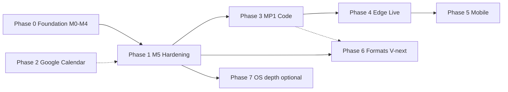

# PRD — MemoryAgent (full product)

## 1. Document control

| Field | Value |
| :--- | :--- |
| **Audience** | Product, engineering, and partners aligning scope across years, not a single milestone. |
| **Normative depth** | This PRD states **what** and **why** by phase; **how** lives in linked specs (`architecture`, APIs, data model, test plan). |
| **Subset PRDs** | [`prd-mp1-distributed.md`](prd-mp1-distributed.md) remains the **MP1-only** contract; it is **incorporated by reference** into Phase D below. |

**Primary references:** [`requirement.md`](../../requirement.md), [`architecture.md`](architecture.md), [`distributed-future-plan.md`](distributed-future-plan.md), [`milestones.md`](milestones.md), [`client-api.md`](client-api.md), [`data-model.md`](data-model.md), [`test-plan.md`](test-plan.md).

---

## 2. Vision

**MemoryAgent** is a **local-first** assistant that turns **files, saved facts, and (where permitted) system calendars** into **retrieval-augmented answers** on the user’s machine, with **on-device** embeddings and chat by default. Long term, the same product **scales down to a Raspberry Pi class edge index** and **scales out to optional edge nodes and mobile companions**, without forking the mental model: **one Client API**, **clear backend roles**, **explicit degraded behavior**.

---

## 3. Goals (product-wide)

| # | Goal |
| :--- | :--- |
| G-1 | **Privacy-by-default:** core chat and memory work without mandatory cloud; user-chosen cloud (e.g. Google Calendar) is **opt-in**. |
| G-2 | **Trustworthy retrieval:** citations, incremental index, metadata filters, honest “I don’t know” when context is missing. |
| G-3 | **OS respect:** capabilities (TCC, folder pickers, calendar) are **scoped** and **explained** per [`permissions-matrix.md`](permissions-matrix.md). |
| G-4 | **One orchestration story:** deployment modes (`standalone`, `host_edge`, `hybrid`, `ios_companion`) share **backend contracts** ([`distributed-future-plan.md`](distributed-future-plan.md)). |
| G-5 | **Operable:** health, logs, benchmarks, and **admin/debug** paths for support without data recklessness. |

---

## 4. Non-goals (product baseline)

- **No** covert exfiltration of user content; **no** required cloud LLM for default product tier.
- **No** iMessage / Apple Journal as v1 **baseline** sources ([`requirement.md`](../../requirement.md) §2.1.1).
- **No** promise of **Google Keep**-class APIs until a supported provider path exists ([`google-calendar-integration.md`](google-calendar-integration.md) out-of-scope note).

---

## 5. Users and scenarios (summary)

| Persona | Needs |
| :--- | :--- |
| **Solo knowledge worker** | Watch folders, PDFs/DOCX, chat + memory, optional calendar. |
| **Power user + edge** | Always-on index on a small home server; chat on laptop ([`distributed-future-plan.md`](distributed-future-plan.md) `host_edge`). |
| **Hybrid** | Local + remote merge for recall ([`distributed-future-plan.md`](distributed-future-plan.md) `hybrid`). |
| **Mobile companion** | Read-oriented access to host-backed memory and tools policy ([`distributed-future-plan.md`](distributed-future-plan.md) `ios_companion`). |

---

## 6. Phased product roadmap (detailed)

Phases are **sequenced for risk and dependency**; parallel work is noted where safe. **M*** tags align with [`milestones.md`](milestones.md).

### Phase 0 — Foundation **(shipped)**

| Item | Detail |
| :--- | :--- |
| **Scope** | M0–M4 per milestones: repo layout, RAG loop, watcher, mirrors, tools, EventKit calendar read/create/search, REST calendar create, PDF/DOCX + file index DB, metadata filters. |
| **Acceptance** | Milestone acceptance in [`milestones.md`](milestones.md) and [`test-plan.md`](test-plan.md). |
| **Docs** | `client-api`, `agent-actions`, `data-model`, `pdf-docx-index-plan` (implemented). |

---

### Phase 1 — Product hardening **(M5)**

| Item | Detail |
| :--- | :--- |
| **Goals** | NFR measurability, log rotation, packaging / install story, structured errors for ops. |
| **Deliverables** | Benchmark script + recorded baseline ([`test-plan.md`](test-plan.md) §7 M5); log policy; **packaging decision** documented ([`m5-packaging-decision.md`](m5-packaging-decision.md)): **no product bundle** at this stage (README + scripts); **signed .app** candidate after core dev complete; optional `launchd` later only if needed. |
| **Dependencies** | Phase 0 stable on reference Mac. |
| **Acceptance** | Repeatable benchmark artifact; logs bounded by default config; **documented** install (source + scripts) exits 0 on clean-environment smoke per [`test-plan.md`](test-plan.md) MT-M5-04; retail PKG/DMG not required until a later release adopts signed app. |
| **Risks** | Scope creep into new features—keep M5 **non-functional** unless a blocker forces a small feature. |

---

### Phase 2 — Google Calendar (opt-in) **(product track)**

| Item | Detail |
| :--- | :--- |
| **Goals** | User **selects** “Include Google Calendar”; OAuth; read path first; **local EventKit + Google** when on, **local only** when off ([`google-calendar-integration.md`](google-calendar-integration.md)). |
| **Deliverables** | **Done / live-smoke validated for read path:** OAuth connect/callback/disconnect state; token storage policy; Include off → local-only/no Google calls; Include on → local EventKit + Google rows merged, sorted, and labeled; Google API failures soft-degrade with local results. **Done / live-smoke validated for write path:** `calendar_target` is required before writes when Google Include is on; web UI exposes Local vs Google target choice for manual event creation; Google target uses `calendar.events` scope and `events.insert`; event appeared in Google Calendar. **Done / live-smoke validated for revocation path:** external Google access revocation soft-degrades and reconnect recovers. Setup guide: [`google-calendar-setup.md`](google-calendar-setup.md). **Remaining:** broader write-scope compliance/release review before treating writes as production-ready. |
| **Dependencies** | Google Cloud project setup validated: Web OAuth client, test user, exact localhost callback URI, client secret storage, Google Calendar API enabled. Sensitive/broader write scopes still need verification/compliance review before broad use. |
| **Acceptance** | Automated tests cover connect/disconnect/config guard, merged list/search, degraded Google behavior, no Google calls when Include off, explicit write target requirement, and mocked Google create (`tests/test_m4_calendar.py`, `tests/test_mp1_pr1.py`). Full cleanup-enabled live smoke passed via `scripts/google-calendar-smoke.py`: OAuth status on; `calendar.list_events` Google source count 14; `calendar.search_past_events` Google source count 20; `calendar.create_event` created Google event `7428q31oduk8koi5jp73tf2bv0`; smoke cleanup deleted it; `POST /calendar/google/disconnect` completed and left Google Include off. Manual web UI smoke passed: Local vs Google target choice was visible and Google Calendar event creation worked from the browser form. External revocation smoke passed: local events remained available, Google degraded safely, and reconnect recovered. |
| **Parallel** | Phase 2 read path began after MP1 local foundation. Continue write-scope work only after preserving M5/MP1 stability and rotating exposed local test secrets. |

---

### Phase 3 — MP1 distributed foundation **(architecture + code)**

| Item | Detail |
| :--- | :--- |
| **Goals** | Backend interfaces, `deployment_mode`, health **degraded** hints, path to Node API **without** breaking standalone ([`prd-mp1-distributed.md`](prd-mp1-distributed.md), [`mp1-pr1.md`](mp1-pr1.md), [`mp1-pr2.md`](mp1-pr2.md)). |
| **Deliverables** | **Done / locally validated:** PR-1 adapters, PR-2 health `deployment` block; `edge_base_url` + `PATCH /config` (+ edge TLS + path-map + **SPKI** `edge_tls_spki_pins_sha256`); edge `GET /health` ([`node_client.py`](../../services/core/memoryagent/node_client.py) with shared [`edge_http.py`](../../services/core/memoryagent/edge_http.py) verify); health + chat `meta`; admin §3.11; **remote retrieval** (`POST /retrieve`, `HostEdge`/`Hybrid`); **ingest** — chat save prefix + tools + watcher route through `IngestBackend`; memory `POST /ingest` after local write; **file/mirror** `POST /ingest` `kind=file` when `edge_ingest_path_*` maps host path → Node path; **hybrid** memory edge push is non-blocking (background task); persistent Chroma-backed local Edge Node (`scripts/run-local-edge.py`) + real HTTP smoke (`scripts/mp1-edge-smoke.py`) passed with memory + file path mapping evidence in [`mp1-implementation-status.md`](mp1-implementation-status.md). **Remaining external gate:** run/waive the same smoke against a non-local HTTPS Edge Node (including CA/SPKI config if enabled). **Next:** richer hybrid ingest than memory-async-only; optional mTLS. |
| **Dependencies** | [`node-api.md`](node-api.md) contract stable enough to implement client; verification gate [`mp1-verification-checklist.md`](mp1-verification-checklist.md). |
| **Acceptance** | SRS/PRD MP1 acceptance + test-plan §7.x; standalone default unchanged. |
| **Note** | MP1 PRD remains the **authoritative MP1** doc; this section only **places** MP1 in the larger roadmap. |
| **Repo sequencing** | **First** post-M5 engineering track for this repository: close the **Next** deliverables in this section, **then** start Phase 2 Google Calendar **code** ([`google-calendar-integration.md`](google-calendar-integration.md)). |

---

### Phase 4 — Distributed operations **(host + edge live)**

| Item | Detail |
| :--- | :--- |
| **Goals** | **Host ↔ Edge** HTTPS Node API operational: health, index status, retrieve, ingest, control reindex ([`node-api.md`](node-api.md)). |
| **Deliverables** | Edge service skeleton; TLS + bearer; host adapters for `RetrievalBackend` / `IngestBackend` remote fan-out; hybrid merge policy **implemented**; degraded UX per distributed plan. |
| **Dependencies** | Phase 3 complete for contracts; ops story for certs and rotation. |
| **Acceptance** | Integration tests host+edge; failure injection proves soft degrade + user-visible reason; security review checklist. |

---

### Phase 5 — Mobile companion **(iOS / later Android)**

| Item | Detail |
| :--- | :--- |
| **Goals** | Companion talks **Client API** to host; on-device sources **policy-gated** (files/calendar/journals only where APIs and privacy allow) ([`distributed-future-plan.md`](distributed-future-plan.md) mobile constraints). |
| **Deliverables** | Thin client; auth; offline/cache strategy **documented**; optional Apple **Foundation Models** where product chooses local inference on phone. |
| **Dependencies** | Phase 4 or strict standalone+host URL for demos. |
| **Acceptance** | Defined in a future mobile PRD/SRS; trace to Client API stability. |

---

### Phase 6 — Ingestion and format expansion **(V-next)**

| Item | Detail |
| :--- | :--- |
| **Goals** | Tabular, slides, mail export, OCR, etc., without breaking index semantics ([`document-format-vnext-plan.md`](document-format-vnext-plan.md)). |
| **Deliverables** | Phases **E–H** in that document (CSV/XLSX → PPTX → email → OCR → legacy office → HTML). |
| **Dependencies** | Parser deps, disk/CPU budgets (incl. Pi profile in same doc). |
| **Acceptance** | Per-format test-plan rows + ingest_stats / file_index compatibility. |

---

### Phase 7 — OS depth and native shell **(optional product)**

| Item | Detail |
| :--- | :--- |
| **Goals** | Reminders read (if feasible), Notes automation **if** prioritized, menu bar / hotkey ([`milestones.md`](milestones.md) Optional). |
| **Deliverables** | Bridge or automation per [`permissions-matrix.md`](permissions-matrix.md); native shell acceptance from milestones. |
| **Dependencies** | Apple permission landscape; no regression on Phase 0–3 core. |
| **Acceptance** | Milestone optional sections + manual MT procedures. |

---

### Phase 8 — Enterprise and hardening **(future)**

| Item | Detail |
| :--- | :--- |
| **Goals** | mTLS, SSO, org policies, audit exports, multi-user—**only if** product enters that market. |
| **Deliverables** | TBD; architecture already **mTLS-ready** in narrative. |
| **Dependencies** | Phases 3–4 stable. |
| **Acceptance** | Separate PRD when initiated. |

---

## 7. Roadmap diagram (high level)

*(Phase 2 can start after Phase 1 stabilizes; Phase 6 can partially parallelize from Phase 1 onward with format ownership.)*

---

## 8. Success metrics (rolling)

| Metric | Target owner |
| :--- | :--- |
| Time to first token (warm/cold) | M5 benchmark doc |
| Idle observation CPU | NFR in requirement |
| Index freshness SLA | M2 + ops runbook |
| OAuth / calendar error rate | Phase 2 dashboard or logs |
| Degraded-mode clarity | User study + structured log review (Phase 4) |

---

## 9. Review and change control

- **Quarterly** (or per release): reconcile this PRD with [`milestones.md`](milestones.md) checkboxes and [`distributed-future-plan.md`](distributed-future-plan.md) decision hooks.
- **Any** new externally visible API: update [`client-api.md`](client-api.md) / [`node-api.md`](node-api.md) in the same release train.
- **Promotion to `main`:** merging **`ma-dist` → `main`** requires **every phase 0–8** in **§6** of this document to be **verified complete** (evidence or approved waiver per phase), using [`ma-dist-promotion-checklist.md`](ma-dist-promotion-checklist.md) **§0.1** and [`CONTRIBUTING.md`](../../CONTRIBUTING.md).

---

## 10. Traceability

| Topic | Document |
| :--- | :--- |
| Full-product software requirements | [`srs-full-product.md`](srs-full-product.md) |
| MP1 only | [`prd-mp1-distributed.md`](prd-mp1-distributed.md) |
| SRS MP1 | [`srs-mp1-distributed.md`](srs-mp1-distributed.md) |
| Calendar opt-in | [`google-calendar-integration.md`](google-calendar-integration.md) |
| Topology & modes | [`distributed-future-plan.md`](distributed-future-plan.md) |
| Delivery checklists | [`milestones.md`](milestones.md), [`test-plan.md`](test-plan.md) |
| `ma-dist` → `main` promotion | [`ma-dist-promotion-checklist.md`](ma-dist-promotion-checklist.md) |
